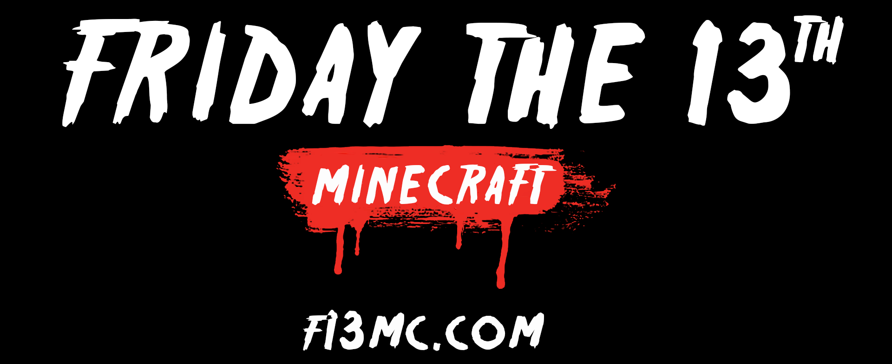

# Friday the 13th Minecraft
> [!IMPORTANT]
> Want to play right now? Connect to **f13mc.com** with Minecraft client 1.12.2 to play on the original server. Play for mommy, Jason.

Friday the 13th - Minecraft Edition is a plugin for you Bukkit/Spigot server that enables players to experience Jason in all of his glory. Play as Jason or one of your favorite counselors as you fight to survive or fight to kill. Featuring customized gameplay as Jason and counselor, players have perks, abilities, and objects to aid in their mission. Hide behind doors, break them down, cut the power, try to repair it if you dare - Friday the 13th is an extensive gameplay addition to your server.

## Getting Started
For Friday the 13th documentation, setup guides and additional information, please see the [Friday the 13th Wiki](https://github.com/austinpilz/FridayThe13th/wiki)

To install the Friday the 13th plugin on your Minecraft server, please download the JAR from the [Friday the 13th Spigot Page](https://www.spigotmc.org/resources/friday-the-13th.43321/) or via the GitHub releases for this repository.

## Deprecation
> [!WARNING]
> Development of F13 MC has ended. This repo has the game in it's final 1.9 form, available only on MC 1.12.2. I am currently building a MC game engine to re-build F13 on top of. This repo is kind of a mess, I started coding this when I was a young kid.

## License
Copyright (C) 2017 Austin Pilz austinpilz[aht]gmail[daht]com

You are permitted to use this plugin for use on your server, regardless of size. You are not permitted to redistribute and/or post the plugin to another site for download, whether you claim it is your own or not. You also not permitted to sell the plugin, it it always to be free.
